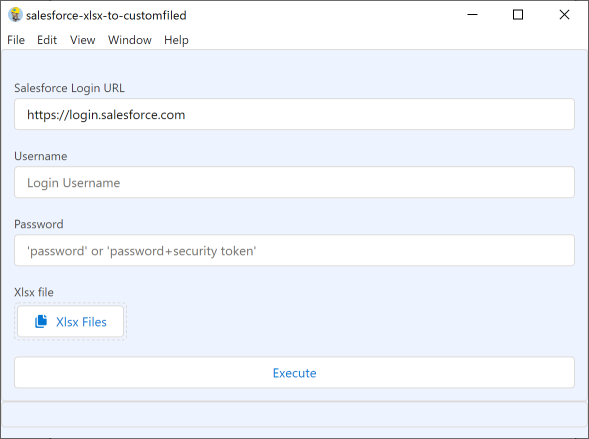
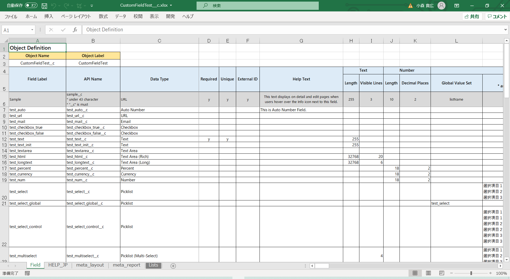

# salesforce-xlsx-to-customfiled

Upsert CustomField and FieldPermissions with Excel.

This is [Electron](https://www.electronjs.org/)-based application.

エクセルファイルに定義したカスタム項目情報を
[SheetJS](https://github.com/SheetJS/sheetjs)で読み取り、[JSforce](https://github.com/jsforce/jsforce)で metadata API を使って一括登録するものです。

もともとコマンドで動かしていたものを身内向けに Electron でデスクトップアプリ化しました。

## Platforms

Windows 64bit.

## Usage

### Quick Start

1. Download [salesforce-xlsx-to-customfiled-win32-x64-1.0.0.zip
   ](https://github.com/takahiro717/salesforce-xlsx-to-customfiled/releases)
2. Run "salesforce-xlsx-to-customfiled.exe".
3. Input login information.
4. Choose "Samples/MinimumSample_Account.xlsx".
5. Press "Execute" button.
6. Finish when all permission results are displayed.

### Define Customfield in .xlsx

[samples.zip](https://github.com/takahiro717/salesforce-xlsx-to-customfiled/releases)

There are sample definitions in "CustomFieldTest\_\_c.xlsx" file.

samples の中に書き方をまとめたエクセルがあります。

### Never give up

If you defined formula type field, perhaps the field will be error. Please retry.

項目の UPSERT は 10 件ずつ一括処理をするため数式などはエラーになりやすいです。再実行すると通ります。

## Roadmap

- I will do code refactoring.
- Writing unit test with Jest.
- Release command line version.

勉強しながら社内用に動けばいいやという作り方だったのでコードをまず綺麗にしたい。テストコード早めに書きたい。

コマンドライン版もリリースしたい。
Salesforce DX を使っている人はコマンドライン版のほうが使いやすいです。

## Contributing

Pull requests are welcome. For major changes, please open an issue first to discuss what you would like to change.

## License

[MIT](/LICENSE)

Copyright (c) 2021 Takahiro Komori
