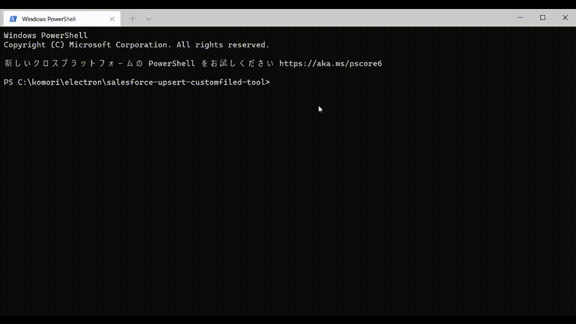

# salesforce-xlsx-to-customfiled

Upsert CustomField and FieldPermissions with Excel.

This is [Electron](https://www.electronjs.org/)-based application.


## Platforms

Windows 64bit.

## Usage Desktop

### Quick Start

1. Download [salesforce-xlsx-to-customfiled-win32-x64-1.0.0.zip
   ](https://github.com/takahiro717/salesforce-xlsx-to-customfiled/releases)
2. Run "salesforce-xlsx-to-customfiled.exe".
3. Input login information.
4. Choose "Samples/MinimumSample_Account.xlsx".
5. Press "Execute" button.
6. Finish when all permission results are displayed.

### Define Customfield in .xlsx


[samples.zip](https://github.com/takahiro717/salesforce-xlsx-to-customfiled/releases)

There are sample definitions in "CustomFieldTest\_\_c.xlsx" file.

### Please retry.

If you defined formula type field, perhaps the field will be error. Please retry.

## Usage command line version



Download [sfxtcf.js](https://github.com/takahiro717/salesforce-xlsx-to-customfiled/releases)

###  Create folder and execute commands bellow.
```
npm init -y
npm install --save-dev jsforce@1.10.1
npm install --save-dev xlsx
```

### Set sfxtcf.js and .xlsx file.
```
-CreatedFolder
├ node_modules
├ package.json
├ package-lock.json
├ sfxtcf.js
└[.xles file]
```

### Update login definision in sfxtcf.js
Refer [JSforce document](https://jsforce.github.io/document/#username-and-password-login)
```
// jsforce メタデータの保存と更新
const conn = new jsforce.Connection({ loginUrl: 'https://test.salesforce.com/' });　//ログインURLの指定する
const username = "xxxx@xxxxxx.xxx"; //ログイン用ユーザーネーム
const password = "password";// パスワードとセキュリティトークン スペース無しでつなげる IP制限を解除しているとトークンは不要
```


### Run
```
node sfxtcf.js xxxx.xlsx
```
Finish when all permission results are displayed.

## Contributing

Pull requests are welcome.


## License

[MIT](/LICENSE)

Copyright (c) 2021 Takahiro Komori

***

# ここから日本語

エクセルファイルに定義したカスタム項目情報を[SheetJS](https://github.com/SheetJS/sheetjs)で読み取り、[JSforce](https://github.com/jsforce/jsforce)で metadata API を使って一括登録するものです。

もともと自分と社内向けにコマンドラインで動かしていたものをElectronを使ってデスクトップアプリケーションとして動くようにしました。

## 対応プラットフォーム

Windowsのみ

※テストしていないけどコマンドライン版なら他の環境でも使えるかもしれません

## 使い方

### クイックスタート

1. [salesforce-xlsx-to-customfiled-win32-x64-1.0.0.zip
   ](https://github.com/takahiro717/salesforce-xlsx-to-customfiled/releases)をダウンロードします
2. 展開して「salesforce-xlsx-to-customfiled.exe」を実行します。
3. 立ち上がった画面にログイン情報を入力します
4. samplesフォルダの「MinimumSample_Account.xlsx」を選択します
5. 「Execute」ボタンを押します
6. 権限の結果が表示されたら完了です

取引先にabcText__cが生成されていたら成功です。

### カスタム項目をエクセルに定義する

samplesの中の「CustomFieldTest\_\_c.xlsx」に対応しているデータ型の記入例があります。

### 失敗しやすいので再実行が必要です

Metadata APIの仕様上、数式や積み上げ集計項目はエラーになりやすいです。<br>予め条件になる項目が登録された状態でないとCreateが成功しません。

再実行すると定義に間違いが無ければ成功します。

## コマンドラインでの使い方
[sfxtcf.js](https://github.com/takahiro717/salesforce-xlsx-to-customfiled/releases) を使います。

### １．Node.jsのインストール
Node.jsがインストールされている必要があります。
動作確認済みのバージョンは14.17.2です。

### ２．適当なフォルダでpackage.jsonを作る
```
npm init -y
```
例えばSalesforce DXを使っていて既にプロジェクトフォルダがあり、その中で使いたいといったときはpackage.jsonがあるはずなのでこの作業は必要ありません。

### ３．バージョンを指定してjsforceをインストールする
```
npm install --save-dev jsforce@1.10.1
```

### ４．sheetJS(xlsx)をインストールする
```
npm install --save-dev xlsx
```

### ５．sfxtcf.js内の設定を書き換えます
ソース中のコメントを参考にしてログイン情報を書き換えます。
```
// jsforce メタデータの保存と更新
const conn = new jsforce.Connection({ loginUrl: 'https://test.salesforce.com/' });　//ログインURLの指定する
const username = "[xxxx@xxxxxx.xxx]"; //ログイン用ユーザーネーム
const password = "[password+token]";// パスワードとセキュリティトークン スペース無しでつなげる IP制限を解除しているとトークンは不要
```

### ６．作業用フォルダ内でコマンドを実行します
作業用フォルダは以下のようになっているはずです。
```
-CreatedFolder
├ node_modules
├ package.json
├ package-lock.json
├ sfxtcf.js
└[.xles file]
```

nodeコマンドから第一引数に「sfxtcf.js」を指定して、第二引数にカスタム項目を定義したエクセルファイルを指定します。
```
node sfxtcf.js xxxx.xlsx
```

エラー等が表示されずに最後に permission result が表示されたら成功です。