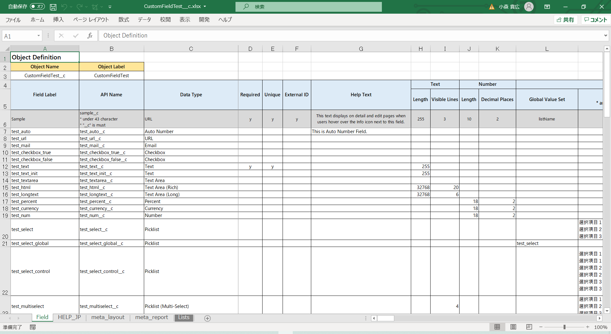

# salesforce-xlsx-to-customfiled

Upsert CustomField and FieldPermissions with Excel.

This is [Electron](https://www.electronjs.org/)-based application.

エクセルファイルに定義したカスタム項目情報を読み取りJSforceのmetadata APIで一括登録するものです。

もともとコマンドで動かしていたものを身内向けにElectronでデスクトップアプリ化したものです。

## Platforms

Windows 64bit.

Electron勉強後に他のプラットフォームも用意するかも。

## Usage

### Quick Start

1. Download [salesforce-xlsx-to-customfiled-win32-x64-1.0.0.zip
](https://github.com/takahiro717/salesforce-xlsx-to-customfiled/releases)
2. Run "salesforce-xlsx-to-customfiled.exe".
3. Input login information.
4. Choose "Samples/MinimumSample_Account.xlsx".
5. Press "Execute" button.
6. Finish when all permission results are displayed.

### Define Customfield in .xlsx

[samples.zip](https://github.com/takahiro717/salesforce-xlsx-to-customfiled/releases)

There are sample definitions in "CustomFieldTest\_\_c.xlsx" file.

samplesの中に書き方をまとめたエクセルがあります。

### Retry Execute

If you defined formula type field, perhaps the field will be error. Please retry.

項目の UPSERT は 10 件ずつ一括処理をするため数式などはエラーになりやすいです。再実行すると通ります。

## License

[MIT](/LICENSE)

Copyright (c) 2021 Takahiro Komori